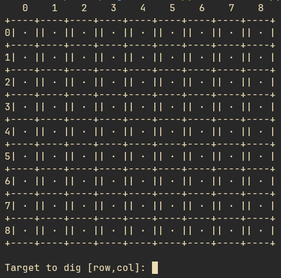

# 💣 Minesweeper 

This Minesweeper game is an attempt to replicate the old 
[minesweeper game](https://www.google.com/search?q=minesweeper).



## WIP

This is not fully baked. If you think that some improvement 
could made to the project, make an issue.

## What is this project?

A fully functional minesweeper game that will run as an application
with the purpose of replicating a minesweeper game. This project emerged as a
practice to reinforce my skills. 

## Requiriments

Python >= 3.10

## 📦 Installation

To play the game you need to clone this repo running this following command:

```bash
git clone https://github.com/SchweizerDiem/Minesweeper-repo.git
```

## Usage

After installing you need to execute the `board.py` file, by running on the command line:

```bash
py.exe .\board.py
```

EVERYTHING IS SETUP!! Now you may play you game :)

## Problems

1. Numbers out of range of the boarder or inputing non-numbers characters.
    - The program still can't deal with those cases but soon I'll be 
      implementing those features onto the game.
